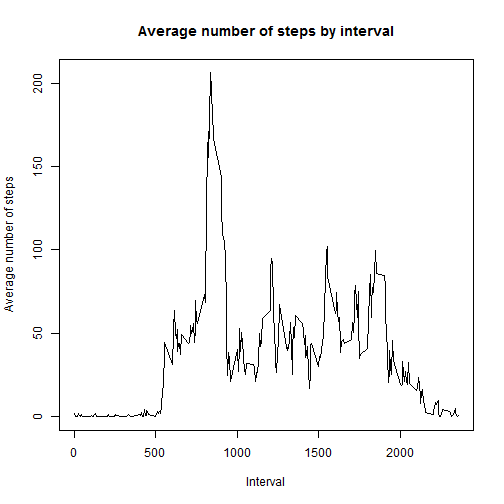

## Loading and preprocessing the data

Load data using read.csv with the activity.csv file in the working directory. Change class of data$steps from integer to numeric so a histogram can be made later.


```r
data <- read.csv("activity.csv")
data$steps <- as.numeric(data$steps)
```


## What is mean total number of steps taken per day?

Use aggregate function to give total amount of steps by the date. NA values are not included. Then a histogram is made to show the frequency of total step counts in different ranges. This gives a visual way to approximate mean and median. The mean and median are then calculated.


```r
steps <- aggregate(steps ~ date, data, sum)
hist(steps$steps, main="Histogram of Total Steps", xlab="Steps")
```

 

```r
mean(steps$steps)
```

```
## [1] 10766.19
```

```r
median(steps$steps)
```

```
## [1] 10765
```

## What is the average daily activity pattern?

Use aggregate function again to give the average steps by the interval. This is then used to make a line plot. The maximum average number of steps by interval is then calculated.


```r
intsteps <- aggregate(steps ~ interval, data, mean)
plot(intsteps$interval, intsteps$steps, type="l", main="Average number of steps by interval", xlab="Interval", ylab="Average number of steps")
```

 

```r
intsteps[which.max(intsteps$steps),]
```

```
##     interval    steps
## 104      835 206.1698
```


## Imputing missing values

The total number of NA values in the steps column is calculated first. Then a new data frame is made by merging the average number of steps data set and the original data set by the interval column. This gives a new column of average steps by the interval and is repeated to match the rows of the original data set. Then NA values in the first steps column, steps.x, is replaced using the average values in the steps.y column using subsetting. Then the steps.y column is removed and the data set is ordered by date and interval.

Now that the missing values are replaced with average values based on the interval, the aggregate function is used again to calculate the total number of steps by the date. A histogram is made with this data and mean/median are calculated. The imputed values appear to have increased the frequencies in the histogram due to more data being used, but the distribution appears the same. The mean and median are the same as the original mean and are equal to each other.


```r
sum(is.na(data$steps))
```

```
## [1] 2304
```

```r
impdata <- merge(data, intsteps, by="interval", all=TRUE, sort=FALSE)
impdata$steps.x[is.na(impdata$steps.x)] <- impdata$steps.y[is.na(impdata$steps.x)]
newdata <- impdata[,-4]
newdata <- newdata[order(newdata$date,newdata$interval),]
newsteps <- aggregate(steps.x ~ date, newdata, sum)
hist(newsteps$steps.x, main="Histogram of Total Steps", xlab="Steps")
```

 

```r
mean(newsteps$steps.x)
```

```
## [1] 10766.19
```

```r
median(newsteps$steps.x)
```

```
## [1] 10766.19
```

## Are there differences in activity patterns between weekdays and weekends?

The lattice package was used so that panel plots could compare weekdays to weekends. The imputed data set is used for this. First the date column is converted to the Date class. A new column, day, is made by using the weekdays function on the date column to have day names for the dates. The day column is then converted to a factor and the levels are changed from days of the week to weekday or weekend. The aggregate function is then used to find the mean number of steps taken by interval and by day, weekday or weekend. A line plot is then made to visualize the differences between the weekday and weekend panels. The plot appears to show that weekday steps have a higher average in earlier intervals while the weekend averages have a more spread out distribution that goes into later intervals.


```r
library(lattice)
newdata$date <- as.Date(newdata$date)
newdata$day <- weekdays(newdata$date)
newdata$day <- as.factor(newdata$day)
levels(newdata$day) <- list("Weekday"=c("Monday","Tuesday","Wednesday","Thursday","Friday"), "Weekend"=c("Saturday","Sunday"))
impsteps <- aggregate(steps.x ~ interval + day, newdata, mean)
xyplot(steps.x ~ interval|day, impsteps, type="l", xlab="Interval", ylab="Average number of steps", layout=c(1,2))
```

 
